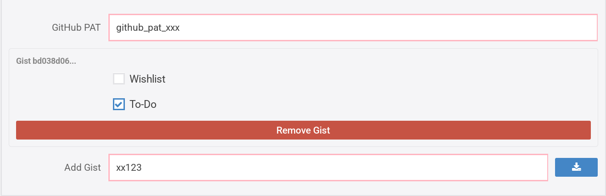
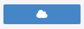
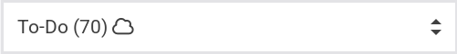

# psnpp-gist

`psnpp-gist` is a companion userscript for [PSNP+](https://psnp-plus.huskycode.dev/) that syncs your game lists to a GitHub Gist, keeping them in sync across browsers and devices.

[](https://github.com/MihaiStreames/psnpp-gist/releases/latest)
[](LICENSE)

## Install

> [!IMPORTANT]
> [PSNP+](https://psnp-plus.huskycode.dev/) must be installed first.

1. Install [Tampermonkey](https://www.tampermonkey.net/) or [Violentmonkey](https://violentmonkey.github.io/)
2. **[Click here to install the script](https://github.com/MihaiStreames/psnpp-gist/releases/latest/download/psnpp-gist-sync.user.js)**
3. Confirm the install prompt

> [!WARNING]
> **GitHub Releases is the only official source.** Each release includes a `.sha256` file. Verify it matches before trusting the script:
>
> ```sh
> sha256sum psnpp-gist-sync.user.js
> cat psnpp-gist-sync.user.js.sha256
> ```

## Setup

You need a GitHub account. **GitHub Gist is the only storage option for now.**

### 1. Get a Gist ID

Create a new (preferably **secret**) Gist at [gist.github.com](https://gist.github.com), or reuse an existing one. The ID is the long hash at the end of the URL, after your username.

### 2. Create a personal access token

GitHub -> Settings -> Developer settings -> Personal access tokens -> Tokens (classic) -> Generate new token -> Generate new token (classic). **Enable only the `gist` scope.** Copy it.

### 3. Configure the script

Open PSNP+ settings. You should now see the **Gist Sync** section at the bottom. Paste your token, Gist ID, and the names of the lists you want to sync (comma-separated, exact match). Save.

That's it!



## Usage

On the game lists page a cloud button appears next to the delete button:



| State      | Meaning                  |
| ---------- | ------------------------ |
| Spinning   | Sync in progress         |
| Blue cloud | Up to date               |
| Red circle | Error - hover to see why |

Synced lists get a ☁ suffix in the dropdown:



Changes push automatically after you save. On page load, the script pulls the latest from your Gist - so opening PSNProfiles on a different browser just works _(provided the script is running)!_

Sync activity is logged to the browser console under the `[psnpp-gist]` prefix. Useful for confirming pushes and pulls are happening.

## Bugs

Found a bug? Open an issue on [GitHub](https://github.com/MihaiStreames/psnpp-gist/issues)! Including any `[psnpp-gist]` errors from the browser console will help me fix it faster.

## Acknowledgments

Built on top of [PSNP+](https://psnp-plus.huskycode.dev/) by [huskydev](https://forum.psnprofiles.com/profile/229685-husky/). None of this would work without it!

## License

MIT. See [LICENSE](LICENSE).

<div align="center">
  Made with ❤️
</div>
